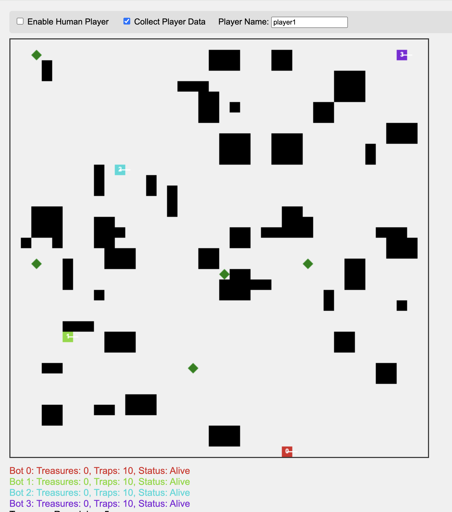

# Treasure Hunter Game

A competitive multiplayer game where AI bots and human players compete to collect treasures while avoiding traps. The game features advanced AI with LSTM-DQN and standard DQN reinforcement learning that improves through gameplay and can learn from human player behavior.

 <!-- Add an actual screenshot if available -->

## 🎮 Game Overview

In Treasure Hunter, players navigate a grid-based arena filled with obstacles, treasures, and traps. Each player has limited vision and must strategically:
- Collect treasures for points
- Deploy traps to eliminate opponents
- Avoid enemy traps
- Navigate obstacles
- Make decisions with limited information

### Key Features

- **Limited Vision**: Players can only see within a cone-shaped field of view
- **Strategic Combat**: Deploy and detonate traps to eliminate opponents
- **Advanced AI**: Multiple AI architectures including LSTM-DQN and standard DQN
- **Human Imitation**: AI can learn from human player behavior
- **Real-time Multiplayer**: Multiple bots compete simultaneously
- **Data Collection**: Records human gameplay for AI training
- **Configurable Agents**: Mix different AI types in the same game

## 🚀 Getting Started

### Prerequisites

- Python 3.9+
- Node.js (for running the web server)
- Modern web browser
- PyTorch 1.9+

### Installation

1. Clone the repository:
```bash
git clone https://github.com/yourusername/treasure-hunter-game.git
cd treasure-hunter-game
```

2. Install Python dependencies:
```bash
pip install torch numpy matplotlib pandas flask flask-cors
```

3. Create necessary directories:
```bash
mkdir player_data training_results checkpoints
```

### Running the Game

1. Start the AI server:
```bash
python main.py
```

2. Open `index.html` in a web browser

3. Configure game settings:
   - Enable/disable human player
   - Set player name
   - Toggle data collection

## 🎯 How to Play

### Controls
- **Arrow Keys**: Move in four directions
- **Spacebar**: Drop a trap at current location
- **E**: Detonate all your placed traps
- **Restart Button**: Start a new game

### Game Rules
1. Collect green diamond treasures for points
2. Each player starts with 10 traps
3. Traps explode in a radius, eliminating players caught in the blast
4. The game ends when:
   - All treasures are collected
   - Time runs out (60 seconds)
   - Only one player remains alive
5. Score = (Treasures × 10) + (20 if alive)

### Vision System
- Players have limited cone-shaped vision
- Can only see treasures, opponents, and traps within vision range
- Must navigate strategically with incomplete information

## 🤖 AI System

### Advanced AI Architectures

#### 1. LSTM-DQN (Long Short-Term Memory + Deep Q-Network)
- Processes sequences of game states
- Captures temporal dependencies in gameplay
- Better at learning complex strategies
- Ideal for dynamic environments

#### 2. Standard DQN (Deep Q-Network)
- Processes individual game states
- Faster training and inference
- Good baseline performance
- Suitable for simpler strategies

#### 3. Player Model (Human Imitation)
- Trained on human gameplay data
- Uses LSTM-DQN architecture
- Mimics human strategies and behaviors
- Can be fine-tuned with reinforcement learning

### State Representation
The AI perceives the game through a 69-feature vector including:
- Bot position and direction
- Visible treasures, enemies, and traps
- Game progress information
- Survival status

### Reward System
Configurable rewards through `agent_config.py`:
```python
REWARD_CONFIG = {
    'treasure_collection': 50,
    'enemy_elimination': 100,
    'strategic_trap_reward': 5,
    'death_penalty': -100,
    # ... and more
}
```

## 📁 Project Structure

```
treasure-hunter-game/
├── index.html                # Game client
├── main.py                   # Flask server & API endpoints
├── config.py                 # Basic configuration
├── agent_config.py           # Agent-specific configuration
├── agents.py                 # DQN & LSTM-DQN implementations
├── models.py                 # Neural network architectures
├── lstm_dqn_player_model.py  # LSTM-DQN player model
├── lstm_dqn_training_manager.py # LSTM training manager
├── reward_calculator.py      # Reward computation logic
├── game_state_processor.py   # State vector processing
├── training_manager.py       # Training statistics management
├── player_data_collector.py  # Human data collection
├── train_lstm_dqn_player_model.py # LSTM-DQN training script
├── game_integration_lstm_dqn.py # Game integration utilities
└── utils.py                  # Utility functions
```

## 🛠️ Configuration

### Agent Configuration (agent_config.py)
```python
# Agent Types
AGENT_TYPES = {
    'PLAYER_MODEL': 'player',     # LSTM-DQN trained on human data
    'LSTM_DQN': 'lstm_dqn',      # LSTM-DQN with RL training
    'STANDARD_DQN': 'standard',   # Standard DQN
    'MAIN_AGENT': 'main'         # Uses the main agent
}

# Bot configurations
BOT_CONFIGS = {
    '0': AGENT_TYPES['PLAYER_MODEL'],    # Bot 0 uses player model
    '1': AGENT_TYPES['LSTM_DQN'],        # Bot 1 uses LSTM-DQN
    '2': AGENT_TYPES['LSTM_DQN'],        # Bot 2 uses LSTM-DQN
    '3': AGENT_TYPES['STANDARD_DQN'],    # Bot 3 uses standard DQN
}

# LSTM-specific configurations
LSTM_CONFIG = {
    'hidden_size': 128,
    'lstm_layers': 2,
    'sequence_length': 10,
    'dropout_rate': 0.2
}
```

### Training Configuration
```python
TRAINING_CONFIG = {
    'lstm_dqn': {
        'learning_rate': 0.001,
        'gamma': 0.99,
        'epsilon_start': 1.0,
        'epsilon_end': 0.01,
        'epsilon_decay': 0.995,
        'batch_size': 64,
        'target_update': 10,
        'memory_capacity': 10000
    },
    # ... configurations for other agent types
}
```

## 📊 Training the AI

### Training LSTM-DQN from Human Data
1. Collect human gameplay data
2. Train the LSTM-DQN model:
```bash
python train_lstm_dqn_player_model.py \
    --data-dir player_data \
    --model-path lstm_dqn_player_model.pth \
    --pretrain-epochs 10 \
    --train-episodes 100
```

### Training During Gameplay
The AI automatically learns during gameplay:
1. Different agent types train independently
2. Experience is stored in replay memory (sequential for LSTM-DQN)
3. Neural networks update based on their configuration
4. Models save periodically

### Monitoring Progress
- LSTM-DQN training statistics: `training_results/lstm_dqn_training_stats.json`
- Training curves: `training_results/lstm_dqn_training_curves.png`
- Model checkpoints: `checkpoints/lstm_dqn_episode_N.pth`

## 🔧 API Endpoints

### Game Server API

| Endpoint | Method | Description |
|----------|--------|-------------|
| `/get_action` | POST | Get AI action for current game state |
| `/game_over` | POST | Report game results for training |
| `/save_player_data` | POST | Save human player session data |
| `/train_player_model` | POST | Train LSTM-DQN model on human data |

## 🎯 Advanced Features

### Mixed Agent Competition
Configure different bots with different AI architectures:
```python
# In agent_config.py
BOT_CONFIGS = {
    '0': 'player',     # Human-like behavior
    '1': 'lstm_dqn',   # Advanced sequential learning
    '2': 'standard',   # Traditional DQN
    '3': 'lstm_dqn',   # Another LSTM bot
}
```

### Custom Reward Shaping
Modify rewards in `agent_config.py`:
```python
REWARD_CONFIG = {
    'treasure_collection': 75,  # Increase treasure value
    'enemy_elimination': 150,   # Emphasize combat
    'strategic_trap_reward': 10, # Reward smart trap placement
}
```

### Training Analysis
Use the LSTM-DQN training manager for detailed analysis:
```python
from lstm_dqn_training_manager import LSTMDQNTrainingManager

manager = LSTMDQNTrainingManager()
manager.plot_training_curves()
manager.create_training_report()
manager.analyze_action_distribution()
```

## 🐛 Troubleshooting

### Common Issues

1. **LSTM memory issues**: Reduce `sequence_length` or `batch_size`
2. **Training instability**: Decrease `learning_rate` or increase `target_update`
3. **Slow LSTM training**: Reduce `hidden_size` or `lstm_layers`
4. **Model not learning**: Check reward configuration and epsilon decay

### Debug Mode
Enable detailed logging:
```python
# In main.py
app.debug = True
```

Monitor LSTM hidden states:
```python
# In agents.py, add to LSTMDQNGameAgent
def debug_hidden_state(self):
    if self.hidden:
        print(f"Hidden state norm: {torch.norm(self.hidden[0]).item()}")
```

## 🤝 Contributing

1. Fork the repository
2. Create a feature branch
3. Commit your changes
4. Push to the branch
5. Create a Pull Request

### Areas for Contribution
- Implement attention mechanisms for LSTM-DQN
- Add prioritized experience replay
- Create new reward schemes
- Develop visualization tools for LSTM sequences
- Optimize training performance

## 📄 License

This project is licensed under the MIT License - see the LICENSE file for details.

## 🙏 Acknowledgments

- Built with Flask, PyTorch, and vanilla JavaScript
- LSTM-DQN architecture inspired by DeepMind research
- Sequential decision-making concepts from reinforcement learning literature
- Community contributions to the PyTorch ecosystem